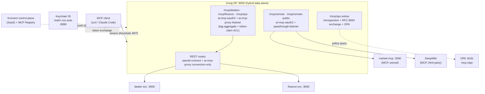

# cai-mcp-demo

**Kong Gateway 3.14 (Konnect hybrid mode) turning Cox Automotive REST APIs into governed MCP servers.**

REST→MCP conversion, tag-aggregated MCP endpoints, OAuth + token-claim tool ACLs, RFC 8693 token
exchange, external OPA policy, and passthrough governance of remote MCP servers — all discoverable via the
Konnect MCP Registry. One `docker compose up` runs everything except the Konnect control plane (SaaS).

## What it demonstrates

| # | Capability | Where |
|---|------------|-------|
| 1 | **OAuth-gated REST APIs** — bearer-only `openid-connect`, scope + audience enforced | `/api/dealers/*`, `/api/finance/*` |
| 2 | **REST → MCP conversion** — `ai-mcp-proxy` `conversion-only` turns each REST route into an MCP tool | 4 REST routes |
| 3 | **Tag-aggregated MCP endpoints** — one listener bundles tools by entity tag | `/mcp/dealers` (2), `/mcp/finance` (2), `/mcp/ops` (2 bundled) |
| 4 | **Token-claim tool ACLs** — allow/deny per tool by the token's `groups` claim (no Kong consumers) | `ai-mcp-proxy` listener |
| 5 | **RFC 8693 token exchange** — an `mcp:use`-only token reaches the APIs via introspection + exchange | `/mcp/ops` |
| 6 | **External OPA policy** — argument-level rule the tool ACL can't express; hot-reloads with no Kong sync | `/mcp/ops` + `opa/policies/mcp.rego` |
| 7 | **Passthrough governance** — front an MCP server you own *and* a third-party one you don't | `/mcp/remote` → market-mcp, `/mcp/remote-public` → DeepWiki |
| 8 | **MCP Registry** — publish + discover the servers in Konnect | `scripts/registry-setup.sh` |
| 9 | **Konnect analytics dashboard** — MCP volume, per-server split, error/denial rate, latency | `scripts/install-dashboard.sh` |

Identity: Keycloak `cox-auto` realm, personas **dana** (dealers), **frank** (finance), **olivia** (ops, both groups).

## Architecture



See [ARCHITECTURE.md](./ARCHITECTURE.md) for the module + Kong-topology tables, and
[TECHSTACK.md](./TECHSTACK.md) for pinned versions.

## Prerequisites

- Docker + Docker Compose v2, `curl`, `jq`, `python3`. decK runs via the bundled `deck` compose service.
- A **Konnect organization** with:
  - A Personal Access Token (PAT) with control-plane admin rights (`KONNECT_TOKEN` in `.env`).
  - **AI Gateway Enterprise** entitlement — `ai-mcp-oauth2` / `ai-mcp-proxy` require it (tech preview).
  - **Organization → Labs → "Catalog - MCP Registry"** enabled (US region only; tech preview) for
    `scripts/registry-setup.sh`. Everything else works without it.

## Quickstart

> **First time? Start with [RUNBOOK.md](./RUNBOOK.md)** — it wraps everything below in one command
> (`./scripts/setup.sh`). The steps here are the manual equivalent / reference.

```bash
cp .env.example .env                 # set KONNECT_TOKEN and KONNECT_REGION (=us)
./scripts/konnect-bootstrap.sh       # create the control plane, generate + upload the DP cert,
                                     # and write CP/TP endpoints into .env (backup at .env.bak)
docker compose up -d                 # kong-dp + keycloak + opa + mock services + market-mcp
docker compose --profile tools run --rm deck gateway sync /config/konnect.yaml
```

Verify the stack, then run the guided demo:

```bash
./scripts/preflight.sh               # tools, container health, port reachability
./scripts/demo.sh                    # numbered, pause-between-steps walkthrough
```

Mint a token and call a governed MCP endpoint directly:

```bash
TOKEN=$(./scripts/get-token.sh olivia --raw)
curl -s http://localhost:8000/mcp/ops -H "Authorization: Bearer $TOKEN" \
  -H 'Content-Type: application/json' -H 'Accept: application/json, text/event-stream' \
  -d '{"jsonrpc":"2.0","id":1,"method":"tools/list"}'
```

## Demo walkthrough (`scripts/demo.sh`)

Each step runs live against the stack. Expected results:

1. **REST OIDC gates** — no token → `401`; dana on the dealer API → `200`; dana on the finance API → `403`
   (missing `finance:read` scope + `finance-api` audience).
2. **REST → MCP conversion** — `tools/list`: `/mcp/dealers` = `list_dealer_customers, list_dealer_vehicles`;
   `/mcp/finance` = `list_invoices, list_floorplans`; `/mcp/ops` = `list_dealer_customers, list_invoices` (bundled by tag).
3. **Token-claim tool ACL** — olivia (ops) → `list_invoices` returns data; frank (finance) → `list_dealer_customers`
   → `403` (his `groups:[finance]` isn't in the tool's `allow:[dealers,ops]`). No Kong consumers involved.
4. **RFC 8693 token exchange** — an `mcp:use`-only token (no API audiences) → `/mcp/ops list_dealer_customers`
   **succeeds** (Kong introspects + exchanges it for a token carrying `dealer-api`/`finance-api`), but the same
   token → `/mcp/dealers` (no exchange) → inner-gate `403`. Watch it: `docker compose logs kong-dp | grep 'exchanging access token'`.
5. **External OPA policy** — olivia `list_invoices` → `200`; olivia `list_invoices` with `query_status=overdue`
   → `403` (an argument-level rule the tool ACL can't express). Edit `opa/policies/mcp.rego` and OPA hot-reloads — no Kong sync.
6. **Passthrough remotes** — `/mcp/remote` unauth → `401`; authed → market-mcp tools;
   `/mcp/remote-public` authed → DeepWiki tools (`ask_question`, `read_wiki_contents`, `read_wiki_structure`). A valid cox-auto token is required for the third-party server.
7. **MCP Registry** — `scripts/registry-setup.sh` publishes and discovers all 5 servers in Konnect.

## Connect Claude Code (MCP client)

Point Claude Code (or any MCP harness) at the governed servers. Every tool call goes through Kong
(`:8000`) no matter how the token was obtained, so OAuth validation, tool ACLs, RFC 8693 token exchange,
and OPA all still run. `scripts/claude-code-setup.sh` registers five MCP servers:

| Server | Route | Default persona |
|--------|-------|-----------------|
| `cox-dealers` | `/mcp/dealers` | dana (dealers) |
| `cox-finance` | `/mcp/finance` | frank (finance) |
| `cox-ops` | `/mcp/ops` | olivia (ops — both groups; the token-exchange route) |
| `cox-market` | `/mcp/remote` | olivia (passthrough → local market-mcp) |
| `cox-deepwiki` | `/mcp/remote-public` | olivia (passthrough → third-party DeepWiki) |

> Prereqs: the stack is up (`docker compose up -d`) and the `claude` CLI is installed. Both scripts
> **print** the commands by default; add `--apply` to actually run them.

### Run it — two ways to get a token

**A) Bearer / ROPC (default, non-interactive — best for a scripted stage demo).** Mints a short-lived
Keycloak token per persona and injects it as a header:

```bash
./scripts/claude-code-setup.sh          # prints `claude mcp add` lines (per-persona tokens)
./scripts/claude-code-setup.sh --apply  # or run them
```

**B) Browser OAuth (the harness gets a proper token the real way).** Claude Code runs the full
authorization-code + PKCE flow against Keycloak's pre-built `claude-code` public client — you log in as a
persona in the browser, no token handling:

```bash
./scripts/hosts-alias.sh --apply                 # one-time: pin `keycloak` → 127.0.0.1 in /etc/hosts (sudo)
./scripts/claude-code-setup.sh --browser --apply # register the 5 servers (no tokens)
# then run `/mcp` in Claude Code and log in: dana.dealer | frank.finance | olivia.ops  (DEMO_PASSWORD)
```

Why the host alias: the issuer is pinned to the internal name `keycloak:8080` so a token's `iss` is
identical whether minted on the host or validated by the Kong DP. Keycloak hands its own
`keycloak:8080` authorize/token/discovery URLs straight to the browser, so the **host** must resolve
`keycloak` too (containers already do, via docker DNS). Bare-name resolution is otherwise
machine-specific (corporate DNS / VPN / Tailscale MagicDNS) — the alias makes it deterministic and
portable. Keycloak's Dynamic Client Registration is disabled, so `--client-id claude-code` (a static
pre-registered public client) is required; without it Claude Code errors with *"Incompatible auth
server: does not support dynamic client registration."* Governance is enforced by the **logged-in
identity's `groups`** at the tool ACL — e.g. logging in as dana works on `cox-dealers` but is
ACL-denied on `cox-finance`.

> **Applying the realm change (browser mode only):** the `claude-code` client's scopes moved to defaults,
> so after pulling this change recreate Keycloak once to re-import the realm:
> `docker compose up -d --force-recreate keycloak` (the dev-mode H2 store is ephemeral, so a fresh
> container re-imports `realm-export.json`).

### Tear down afterwards

`claude-code-teardown.sh` is the inverse of setup — it unregisters the five servers and (opt-in) removes
the host alias. It does **not** stop the stack, so re-running the demo later is one command.

```bash
./scripts/claude-code-teardown.sh --apply               # unregister the MCP servers from Claude Code
./scripts/claude-code-teardown.sh --apply --with-hosts  # also remove the /etc/hosts keycloak alias
docker compose down                                     # stop the stack   (add -v for a full reset)
```

Browser mode caches an OAuth token in your system keychain; `claude mcp remove` (which teardown runs)
drops the server entry — to clear the cached credential too, use the auth controls under `/mcp` in
Claude Code, or delete the MCP entry in Keychain Access.

## demo-ui — the visual cockpit

A Cox-branded web cockpit that drives the same live stack as `scripts/demo.sh`, but **visualizes each
governance decision** — a plugin-chain trace (persona → ai-mcp-oauth2 → [exchange] → ACL → [OPA] →
upstream) that lights green/red, the plain-language "why", the token claims (BEFORE/AFTER on the
exchange step), and the raw response.

Two ways to run it — both serve `http://127.0.0.1:4000`:

```bash
# 1) All-in-one — it's a Compose service (reaches Kong/Keycloak on the in-network hostnames):
docker compose up -d                       # brings up the whole stack INCLUDING demo-ui

# 2) Host-run — needed only to drive Stack-mode execute actions (see below):
scripts/ui.sh                              # Node 20+ host; npm-installs on first run
```

Five modes (left nav) — the cockpit opens on **Overview** so it explains itself before you drive it:

- **Overview** *(default landing)* — a read-first, customer-facing page: who the three people are
  (Dana / Frank / Olivia), a matrix of which of the four MCP tools each may call, the seven steps
  (each with a plain "what it proves"), and a legend for reading verdicts. Nothing to run — it's the
  "what the hell is being demoed" answer.
- **Demo** — the scripted 7-step story with a top stepper. Each step shows its plain-language headline
  and "Proves:", then ▶ Run fires the real calls; every call row carries the caller's **identity badge**
  (`no token` / Dana / Frank / Olivia) and an honest verdict label, over the plugin-chain trace.
- **Present** — the same 7 scenes as a self-driven **tell-show-tell** walkthrough: ▶ Run enters a
  scene, then one **Next ▸** advances the setup Tell → each live call (one per click, cumulative) → the
  takeaway Tell → the next scene. Presenter/self-paced; identical live calls to Demo, single-sourced from
  `scenarios.js`.
- **Explore** — a free sandbox: choose persona + scope override + endpoint + tool + args → Run.
- **Stack** — live `docker ps` status tiles + a deep-link to the Konnect "Cox Automotive: Governed MCP"
  analytics dashboard (set `KONNECT_DASHBOARD_ID` in `.env`). The whitelisted **execute** actions
  (`up`, `down`, `sync`, `preflight`, `smoke`, `registry-setup`, streamed to a terminal) are **host-only**
  — they appear when you launch via `scripts/ui.sh`. In the containerized cockpit they're replaced by a
  note, because a container shouldn't tear down its own compose project.

Local-only (published on `127.0.0.1`, no UI auth); all secrets (PAT, client secrets) stay server-side
and never reach the browser. No build step. The 7 steps and their customer-facing copy are data in
`demo-ui/scenarios.js` (the single source of truth for both Overview and Demo; mirrors `demo.sh`);
the personas/tool-matrix/legend are `demo-ui/public/content.js`; the response→verdict classifier is
`demo-ui/verdict.js`. Unit tests: `cd demo-ui && npm test` (verdict classifier + copy/render integrity).

## Repo layout

- `dealer-svc/`, `finance-svc/` — Node/Express mock REST APIs (converted to MCP tools).
- `market-mcp/` — local Cox-themed MCP server (Streamable HTTP), the `/mcp/remote` passthrough target.
- `keycloak/realm-export.json` — pre-baked `cox-auto` realm (zero manual clicks).
- `kong/konnect.yaml` — the entire declarative decK config.
- `opa/policies/mcp.rego` — external policy for `/mcp/ops`.
- `konnect/mcp-registry/*.json` — registry create + publish bodies.
- `konnect/dashboards/cai-mcp-analytics.json` — the Konnect "Governed MCP" analytics dashboard.
- `scripts/` — `setup` (one-shot orchestrator), `konnect-bootstrap`, `get-token`, `rebuild`, `registry-setup`, `install-dashboard`,
  `claude-code-setup`, `demo`, `preflight`, `smoke-test`, `ui` (launches the demo-ui cockpit).
- `demo-ui/` — host-run Node/Express + vanilla-JS cockpit (server.js + adapters + `public/` SPA).
- `NOTES.md` — doc-vs-reality findings + verified plugin-schema facts (trust this over memory).

## Troubleshooting

- **DP won't connect to Konnect.** Re-run `scripts/konnect-bootstrap.sh` (idempotent) and confirm
  `certs/tls.crt` + `certs/tls.key` exist and `KONNECT_CP_ENDPOINT`/`KONNECT_TP_ENDPOINT` in `.env` match
  your org. Check `docker compose logs kong-dp` for TLS/cert errors.
- **Every token 401s at Kong.** Keycloak's issuer is pinned to `http://keycloak:8080` so host-minted and
  DP-validated tokens share one `iss`. If you changed `KC_HOSTNAME`, tokens minted via `localhost:8080`
  will mismatch — keep the pin. Re-import realm edits with `docker compose up -d --force-recreate keycloak`
  (dev mode uses ephemeral H2).
- **`audience`/RFC-8707 401 on an MCP listener.** The listeners set `insecure_relaxed_audience_validation:
  true` on `ai-mcp-oauth2` because our Keycloak audiences (`mcp-*`) differ from the resource URL;
  authorization is enforced by the inner OIDC gate + the token-claim ACL instead.
- **Token exchange fails `invalid_client / Audience not found`.** Keycloak's exchange `audience` parameter
  must name a registered *client* — request the API *scopes* instead (their mappers add the audiences).
  The subject token must also carry `kong-exchange` in `aud` (the `mcp:use` scope provides it).
- **OPA denies everyone / allows everyone.** The `groups` header is base64-encoded JSON
  (`["ops"]` → `WyJvcHMiXQ==`); the rego `json.unmarshal(base64.decode(...))`s it. Enable
  `include_parsed_json_body_in_opa_input` so the body reaches `input.request.http.parsed_body`.
- **Registry script 400/404.** `description` must be ≤100 chars (400 otherwise). A 404/permission error
  means **Catalog - MCP Registry** isn't enabled in Konnect Labs for your region (US-only tech preview).
- **Host `curl localhost:3001` misses the container.** A local dev server can squat the debug port. Real
  traffic uses Kong `:8000`; override `DEALER_SVC_PORT`/`FINANCE_SVC_PORT`/`MARKET_MCP_PORT` in `.env`, or
  test in-network: `docker compose exec finance-svc node -e "..."`.

## Known Issues

- **The cockpit requests `/favicon.ico`** which the server doesn't serve → one harmless `404` in the
  browser console. Cosmetic only; no functional impact. (Add a favicon route/file to silence it.)
- **Rule 1 of the OPA policy (finance/ops-only for `list_invoices`) is shadowed by the tool ACL** on
  `/mcp/ops`, so it never independently decides live. It stays as an "entitlement-as-code" illustration;
  the argument-level rule (Rule 2, `query_status=overdue`) is the one that visibly makes OPA the decider.
- **Keycloak secrets are baked into `realm-export.json`** (a static import) **and** mirrored in `.env` /
  `.env.example`. If you change a client secret or the demo password, change it in **both** places.
- **`ai-mcp-oauth2` + the MCP Registry are tech preview** (AI Gateway Enterprise / Konnect Labs).
  Availability varies by org tier and region (Registry is US-only). Scripts fail with a helpful message
  when a capability isn't enabled.
- **DeepWiki is a live third-party service.** `/mcp/remote-public` depends on `mcp.deepwiki.com` being
  reachable and on its protocol staying ≥ `2025-06-18`. Swap `REMOTE_PUBLIC_MCP_URL` in `.env` for any
  other remote MCP server if needed.
